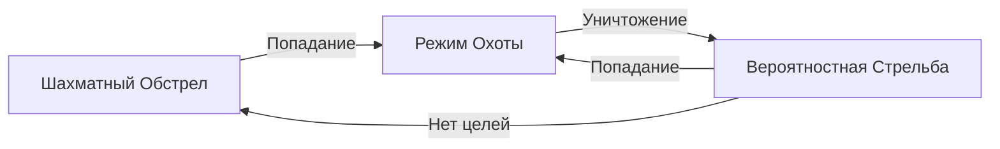

---

# SeaBattle: ИИ для "Морского боя" 

<div align="center">

[](https://www.python.org/)
[](#архитектура)
[](#алгоритмы)

*Интеллектуальный бот, сочетающий вероятностное моделирование с адаптивными стратегиями*

</div>

## 🎯 О проекте

Полноценная реализация классической игры "Морской бой" формата "человек против бота", где бот использует **комбинацию жадных алгоритмов и вероятностного моделирования** для принятия решений. Основной фокус - создание конкурентного ИИ с продуманной архитектурой.

## Особенности

### Умный бот с многоуровневой стратегией
- **Адаптивное поведение** - бот меняет тактику в зависимости от ситуации на поле
- **Вероятностное моделирование** - расчет наиболее вероятных позиций кораблей
- **Эффективный поиск** - комбинация разных подходов для оптимального покрытия поля

### Стек технологий
- **Язык:** Python
- **GUI:** Tkinter
- **Архитектура:** ООП + State Pattern
- **Алгоритмы:** Вероятностная модель, жадные алгоритмы

## 🚀 Алгоритмическая реализация

### 1. Вероятностная карта

**Суть:** Строит "тепловую" карту вероятностей (матрица того же размера, что и поле) нахождения кораблей, перебирая все возможные позиции.

```python
for ship_size in active_sizes:
  for orientation in [1, 2]:
    for x in range(self._size):
      for y in range(self._size):
        if self._can_place_ship(x, y, ship_size, orientation, checked_cords):
          self._add_ship_weight(x, y, ship_size, orientation)
```

**Что это дает:**
- Учет всех возможных конфигураций поля
- Приоритет крупных кораблей (больший вес)
- Динамическая адаптация по мере игры

### 2. Многоуровневая система принятия решений

Бот работает как автомат с четкими переходами:



**Реализованные состояния:**

#### ♟️ ChessboardState (Шахматный порядок)
- **Цель:** Быстрое покрытие поля с максимальной эффективностью
- **Эффективность:** Хорош против крупных кораблей
- **Оптимизация:** Гарантированное попадание в любой корабль за минимальное число ходов

#### 🎯 HuntState (Режим охоты)
- **Активация:** После первого попадания
- **Логика:** Интеллектуальный поиск направления корабля
- **Оптимизация:** Исключение невозможных позиций, приоритет логичных направлений

#### 📊 ProbabilityState (Вероятностный таргетинг)
- **Основа:** Стрельба по клеткам с максимальным весом из вероятностной карты
- **Обновление:** Карта пересчитывается при значительных изменениях
- **Оптимизация:** Экономия ресурсов за счет непостоянных вычислений карты

### 3. Специальный алгоритм для вероятностного моделирования расположения малых кораблей

**Проблема:** Когда остаются только корабли длиной 1-2 клетки, вероятностная карта становится менее эффективной.

**Решение:** Дополнительный алгоритм, основанный на анализе окружения:

```python
for x in range(self._size):
  for y in range(self._size):
    if (x, y) in checked_cords:
      continue

      empty_around = 0
      for dx, dy in [(-1, -1), (-1, 0), (-1, 1), (0, -1), (0, 1), (1, -1), (1, 0), (1, 1)]:
        nx, ny = x + dx, y + dy
        if 0 <= nx < self._size and 0 <= ny < self._size and (nx, ny) in checked_cords:
          empty_around += 1

      self._map[x][y] = empty_around * 10
```

**Суть:** Маленькие корабли часто прячутся среди промахов - этот алгоритм их довольно эффективно находит.

## 📊 Производительность и Анализ

### Сильные стороны:
- **Тактическая гибкость** - бот адаптируется под ситуацию
- **Эффективность на стандартном поле** - выигрывает у большинства игроков
- **Прозрачная логика** - можно понять каждое решение бота
- **Статистика** - в среднем бот может выиграть за 40-50 ходов

### Ограничения и Bottleneck

#### Производительность
```python
# Текущая наибольшая сложность: O(k × n² × L)
# где: k - корабли, n - размер поля, L - длина корабля
"Bottleneck" при размерах поля, больше 15x15
```

**Проблемы:**
1. **Полный перебор** - не масштабируется для больших полей
2. **Дублирование вычислений** - многие конфигурации проверяются многократно
3. **Наивные веса вероятностной карты** - множители подобраны интуитивно, что не всегда дает ожидаемый результат

#### Алгоритмические ограничения
- **Детерминированность** - бот обучается только в процессе одной игры
- **Статичные стратегии** - не адаптируется под стиль конкретного игрока
- **Нелинейные зависимости** - производительность сильно падает с ростом размера поля


## Roadmap и Возможности улучшения

### Планируется внедрить: технологии машинного обучения, возможность анализировать стиль игрока. Это позволит боту более грамотно принимать решения и адаптироваться под стиль оппонента. За счет машинного обучения "наивные" веса вероятностной карты будут заменены на обученные, что может позволить боту генерировать стратегии лучше.

## Дополнительный вклад в проект

Приветствуются:
- Идеи по оптимизации алгоритмов
- Новые стратегии для бота
- Улучшения интерфейса
- Тесты и баг-репорты

---
